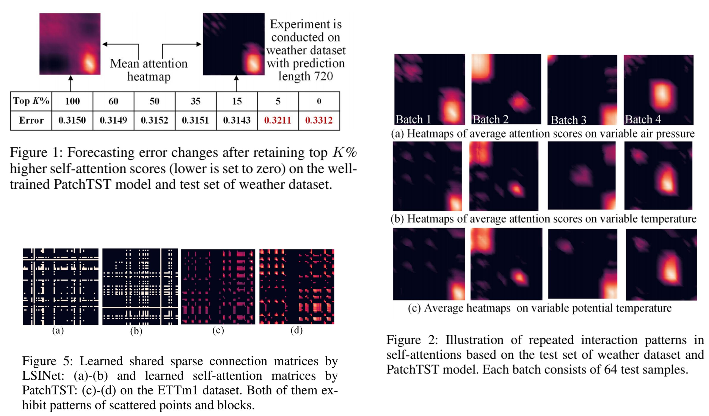
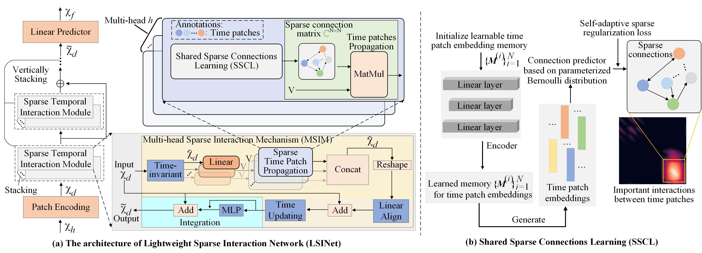

# A Lightweight Sparse Interaction Network for Time Series Forecasting (LSINet,AAAI2025)

## Motivation 

One the one hand, as shown in Figure 1, considering the most learned lower scores are redundant and ineffective, using SAM to find the small part of important interactions is too computationally expensive. Hence, we introduce a sparse Bernoulli distribution to directly predict the latent sparse pairwise interactions between time steps, replacing the standard Q–K–V computation.

On the other hand, We also empirically observe the repeated interaction patterns in the self-attention heatmap, as shown in Figure 2. On the weather dataset, through the heatmap of a single variable (e.g., air pressure in Figure 2(a)) with different sample batches, we observe important temporal interactions (the most highlighted areas) always repeatedly occur along the diagonal of the heatmap. This phenomenon also exists across variables (Figure 2(a), (b), and (c)), motivating us to learn a shared attention matrix and design a time-invariant module to capture temporal dependencies.





## Overview

We propose a Lightweight Sparse Interaction Network (LSINet) for TSF task. Inspired by the sparsity of self-attention, we propose a Multihead Sparse Interaction Mechanism (MSIM). Different from self-attention, MSIM learns the important connections between time steps through sparsity-induced Bernoulli distribution to capture temporal dependencies for TSF. The sparsity is ensured by the proposed self-adaptive regularization loss. Moreover, we observe the shareability of temporal interactions and propose to perform Shared Interaction Learning (SIL) for MSIM to further enhance efficiency and improve convergence. LSINet is a linear model comprising only MLP structures with low overhead and equipped with explicit temporal interaction mechanisms.




## Reference
```
  @inproceedings{zhang2025lightweight,
  title={A Lightweight Sparse Interaction Network for Time Series Forecasting},
  author={Zhang, Xu and Wang, Qitong and Wang, Peng and Wang, Wei},
  booktitle={Proceedings of the AAAI Conference on Artificial Intelligence},
  volume={39},
  number={12},
  pages={13304--13312},
  year={2025}
}
```


